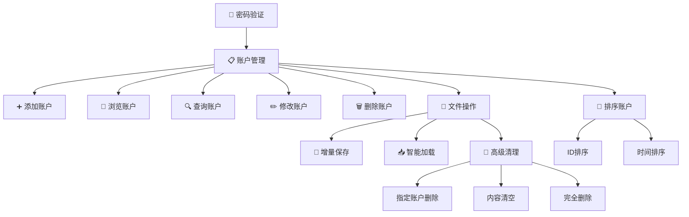
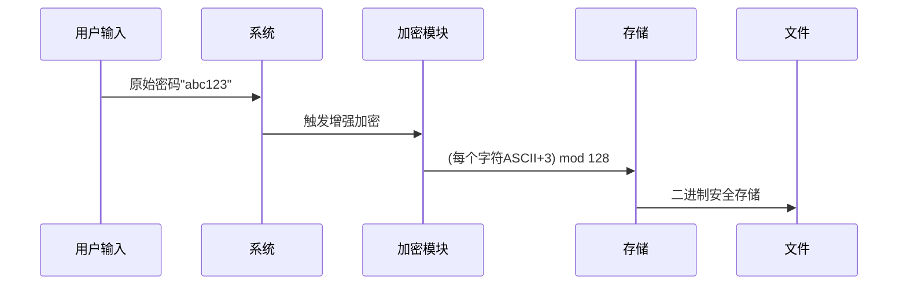

# 🔒 用户隐私信息管理系统 (C++重构版)

<p align="center">
  
  
  
  
  
</p>

## 🌟 项目概述

基于C++重构的隐私信息管理系统，采用面向对象设计和vector容器存储账户信息，提供更安全的密码管理和加密存储功能。系统在原有功能基础上新增时间戳记录、账户排序、增量存储等高级特性，大幅提升安全性和用户体验。

### 主要改进亮点：
- ✅ **面向对象架构**：使用类封装实现高内聚低耦合
- ✅ **时间戳记录**：精确跟踪账户创建时间
- ✅ **增量存储**：高效文件同步机制
- ✅ **多维度排序**：支持ID/创建时间排序
- ✅ **增强加密**：改进的模128加密算法
- ✅ **二进制存储**：高效安全的数据持久化
- ✅ **跨平台支持**：Windows/Linux/macOS兼容


## 🌟 核心功能概览




## 🛠 系统架构

### 🔑 类结构设计

```c++
class AccountSystem {
private:
    class Account {
    public:
        int id;                     // 唯一标识符
        string accountLocation;     // 账号位置/网址
        string description;         // 账号描述
        string username;            // 用户名
        string password;            // 加密密码
        string createTime;          // 账户创建时间戳
    };
    
    vector<Account> accounts;       // 账户存储容器
    const string dataFile = "accounts.dat"; // 二进制数据文件
    // ... 其他成员和方法 ...
};
```

### 📊 新增功能模块

| 功能模块       | 描述                 | 技术亮点          |
| :------------- | :------------------- | :---------------- |
| **⏱️ 时间记录** | 账户创建时间精确到秒 | 跨平台时间处理    |
| **🔄 增量存储** | 只同步变更数据到文件 | 内存-文件数据同步 |
| **📊 账户排序** | 多维度排序账户       | 自定义排序算法    |
| **🧹 智能清理** | 多级文件清理选项     | 二次密码验证保护  |
| **🔍 模糊搜索** | 多字段关键字搜索     | 智能匹配算法      |
| **👁️ 密码显示** | 可选密码明文浏览     | 安全控制机制      |
| **🗑️ 批量删除** | 一键删除所有账户     | 三重确认机制      |

## 🚀 快速开始

### 开发环境

- **IDE**: Visual Studio 2022
- **编译器**: MSVC 或 GCC
- **语言标准**: C++11
- **依赖库**: iostream, fstream, vector, chrono 等标准库

### 编译与运行

```bash
# 使用G++编译
g++ -std=c++11 User_Privacy_Management.cpp -o account_manager

# 运行程序
./account_manager
```

### 🧩 增强型操作菜单

```text
-------------------------------------------
|          用户隐私信息管理系统              |
-------------------------------------------
|+++++++++++++++++++++++++++++++++++++++++|
| *            1. 添加账户               * |
|* *           2. 浏览账户              * *|
| * *          3. 搜索账户             * * |
| * *          4. 删除账户             * * |
| * *          5. 修改账户             * * |
| * *          6. 保存到文件           * * |
| * *          7. 从文件加载           * * |
| * *          8. 清理文件             * * |
|* *           9. 排序账户              * *|
| *            0. 退出                    *|
|+++++++++++++++++++++++++++++++++++++++++|
-------------------------------------------
```


## 🔒 安全机制增强

### 🔄 改进加密流程



### 🛡️ 三重防护机制

1. 管理员操作需密码验证
2. 敏感操作(删除/清理)二次验证
3. 跨平台密码隐藏输入(`_getch`/`stty`)


## 📁 文件存储格式(二进制)

```c++
// 文件存储结构：
[ID:int]
[账号位置长度:size_t][账号位置数据]
[描述长度:size_t][描述数据]
[用户名长度:size_t][用户名数据]
[密码长度:size_t][加密密码数据]
[时间戳长度:size_t][时间戳数据]
```


## 🚀 已实现的AI改进方案

### 🔒 安全增强（已实现）

- 改进加密算法（模128加密）
- 密码隐藏输入功能
- 敏感操作二次验证
- 操作确认机制

### 💡 功能扩展（已实现）

- 账户创建时间记录
- 多维度排序功能（ID/时间）
- 增量存储系统
- 批量账户删除
- 密码明文显示选项
- 二进制文件存储

### ⚡ 性能优化（已实现）

- vector容器高效存储
- 二进制文件IO优化
- 智能数据加载（跳过重复项）
- 输入缓冲清理机制

### 🛡️ 健壮性提升（已实现）

- 输入数据验证
- 文件错误处理
- 跨平台兼容实现
- 异常输入处理


## 📅 未来开发路线

### 🔒 安全增强

- 实现AES加密算法
- 增加密码强度检测
- 添加操作审计日志
- 多因素身份验证

### 💡 功能扩展

- 账户分类/标签系统
- 密码自动生成器
- 数据导出功能(CSV/JSON)
- 账户过期提醒
- GUI界面开发

### 🌐 网络功能

- 端到端加密云同步
- 移动端配套应用
- 安全远程访问
- 自动备份系统


## ⚠️ 重要注意事项

1. 默认管理员密码为 `123456`（可在代码中修改）

2. 文件存储为二进制格式（`accounts.dat`）

3. 密码加密算法仍为教学级**不适合高安全场景**

4. 支持Windows/Linux/macOS系统

   

主要改进点总结：

1. **架构升级**：从C面向过程到C++面向对象

2. **存储优化**：链表→vector，文本→二进制存储

3. **安全增强**：

   - 改进加密算法(ASCII+3 mod 128)
   - 跨平台密码隐藏输入
   - 敏感操作二次验证

4. **新增核心功能**：

   - 账户创建时间戳
   - 多维度排序(ID/时间)
   - 增量存储系统
   - 智能文件清理

5. **体验优化**：

   - 批量操作支持
   - 密码明文显示开关
   - 响应式菜单设计

6. **跨平台支持**：兼容Windows/Linux/macOS

   

<p align="center"> 🚀 面向对象设计 · 跨平台支持 · 学习交流 🚀 </p> 