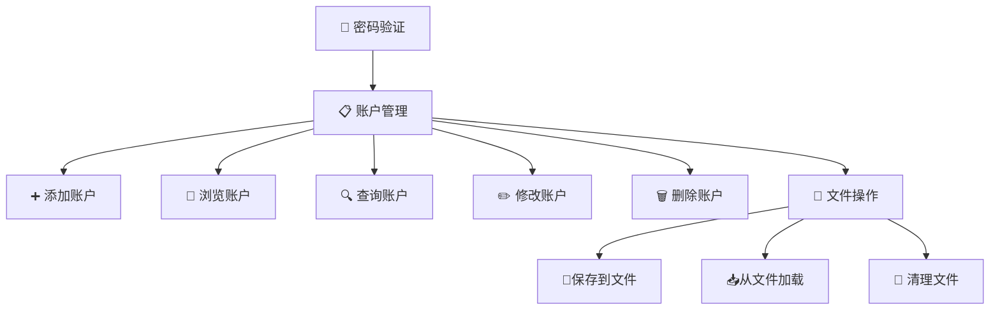
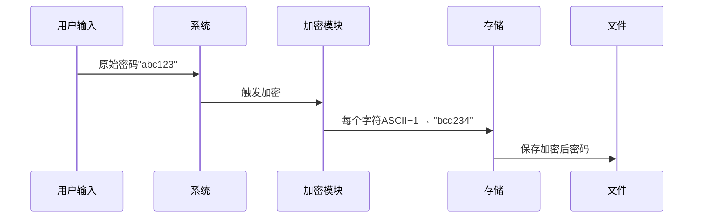

# 🔒 用户隐私信息管理系统 

<p align="center">
  
  
  
  
  
</p>


## 🌟 项目概述

一个基于C语言开发的隐私信息管理系统，采用链表数据结构存储账户信息，提供安全的密码管理和加密存储功能。系统包含完整的账户管理生命周期：添加、浏览、查询、修改、删除及文件存储功能。


## 🌟 核心功能概览




## 🛠 系统架构

### 🔑 数据结构设计

```c
typedef struct Account {
    int id;                     // 唯一标识符
    char Account_location[50];  // 账号位置/网址
    char description[50];       // 账号描述
    char username[50];          // 用户名
    char password[50];          // 加密密码
    struct Account* next;       // 下一个节点指针
} Account;
```

### 📊 功能模块

| 功能模块       | 描述           | 安全特性         |
| :------------- | :------------- | :--------------- |
| **🔐 密码验证** | 管理员身份验证 | 3次尝试限制      |
| **➕ 添加账户** | 创建新账户记录 | 密码自动加密     |
| **👁️ 浏览账户** | 查看所有账户   | 可选密码明文显示 |
| **🔍 查询账户** | 多字段搜索账户 | 模糊匹配支持     |
| **✏️ 修改账户** | 更新账户信息   | 操作前验证       |
| **🗑️ 删除账户** | 移除账户记录   | 三重验证机制     |
| **💾 文件操作** | 数据持久化管理 | 一键清理功能     |


## 🚀 快速开始

### 开发环境

- **IDE**: Visual Studio 2022
- **编译器**: MSVC
- **依赖库**: stdio.h, string.h, stdlib.h

### 编译与运行

```bash
# 编译程序
gcc codedemo.cpp -o account_manager

# 运行程序
./account_manager
```

### 🧩 操作菜单

```text
-------------------------------------------
|+++++++++++++++++++++++++++++++++++++++++|
| *                                     * |
|* *            🆕 1. 添加账户          * *|
| * *           👀 2. 浏览账户         * * |
| * *           🔎 3. 查询账户         * * |
| * *           ❌ 4. 删除账户         * * |
| * *           ✏️ 5. 修改账户         * * |
| * *           💾 6. 保存到文件       * * |
| * *           📥 7. 文件信息加载     * * |
| * *           🧹 8. 清理文件信息     * * |
|* *            🚪 9. 退出            * * |
| *                                     * |
|+++++++++++++++++++++++++++++++++++++++++|
-------------------------------------------
```


## 🔒 安全机制详解

### 🔄 密码加密流程




### 🛡️ 三重删除验证

1. 输入账号位置（网址）
2. 输入用户名
3. 输入密码（自动加密比对）

> ✅ 三者完全匹配才会执行删除


## 📁 文件存储格式


```text
[ID] [账号位置] [描述] [用户名] [加密密码]
```

示例记录：

```text
1 www.example.com 购物网站 user1 bcd234
2 www.bank.com 银行账户 john_doe xpsmeft
```


## 🚀 项目改进方向(参考AI方案)

### 🔒 安全增强

- 实现更强大的加密算法（如AES）
- 增加密码强度检测机制
- 添加登录日志和操作审计功能
- 实现多因素身份验证

### 💡 功能扩展

- 支持账户分类/标签系统
- 增加密码自动生成器
- 添加数据导出功能（CSV/JSON格式）
- 实现账户过期提醒功能
- 开发图形用户界面（GUI）

### ⚡ 性能优化

- 使用哈希表加速查询操作
- 实现二进制文件存储提高IO效率
- 添加内存泄漏检测机制
- 引入数据压缩存储

### 🌐 网络功能

- 添加网络备份/同步功能
- 实现安全的远程访问
- 开发移动端配套应用
- 增加云存储支持

### 🛡️ 健壮性提升

- 增加输入数据验证和过滤
- 实现操作撤销/恢复功能
- 添加自动备份机制
- 完善错误处理和数据恢复


## ⚠️ 重要注意事项

1. 默认管理员密码为 `123456`（可在代码中修改）
2. 所有字段最大长度为 **49个字符**
3. 文件存储路径为程序同目录下的 `accounts.txt`
4. 密码加密为简单算法，**不适合高安全场景**

<p align="center"> 🚀 欢迎讨论 · 遵守法规 · 共同进步 🚀 </p> ```
